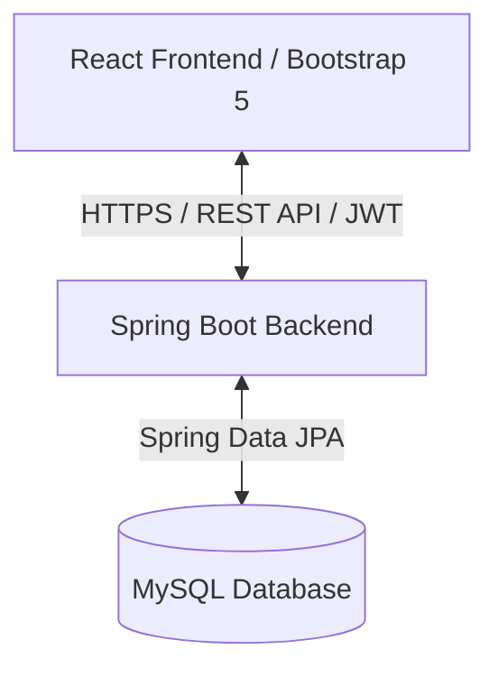
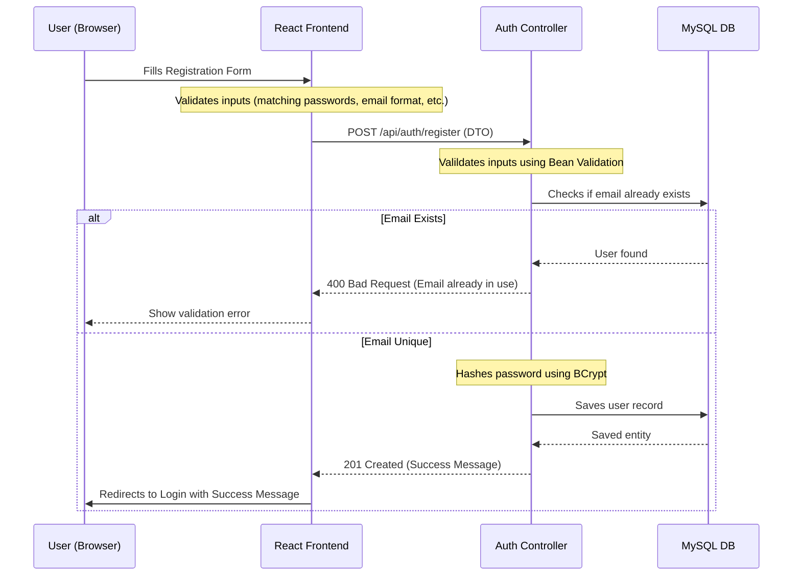
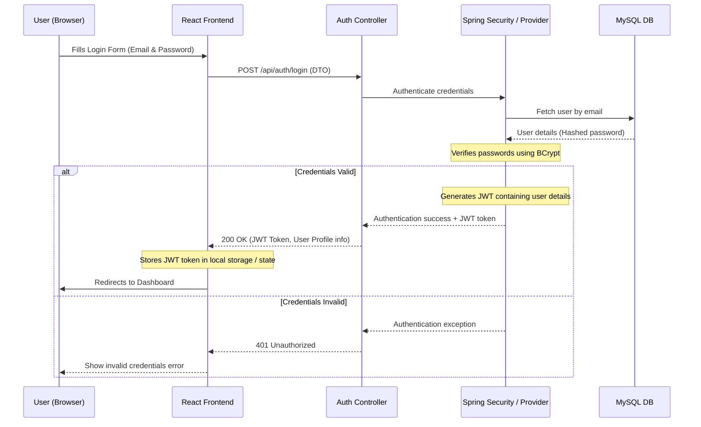
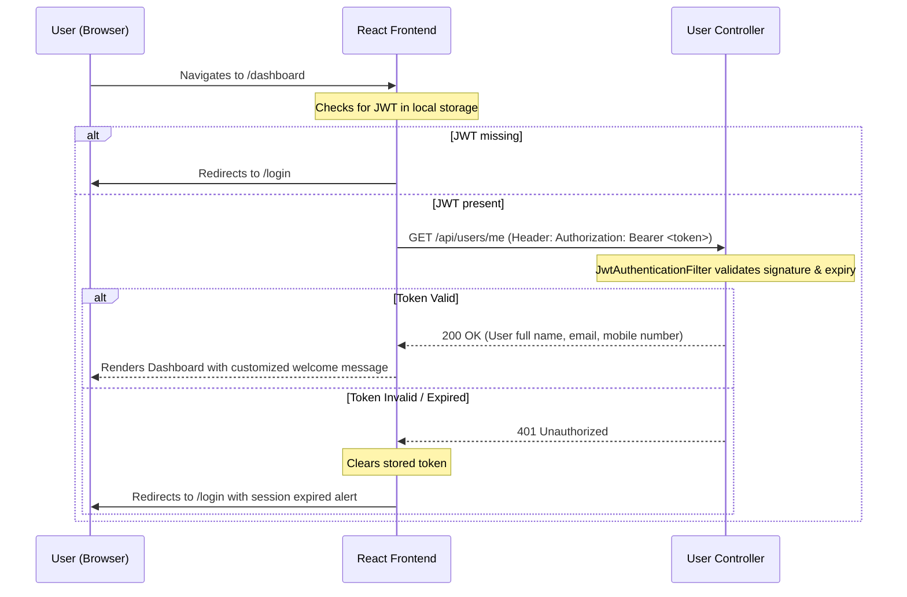

# Luxury Gift Hampers - Architecture & Design Plan

This document outlines the proposed system architecture, folder structure, database schema mapping, API design, and user workflows for the **Luxury Gift Hampers** full-stack application.

---

## Architecture Overview

The system follows a standard decoupled Client-Server architecture:



### Components
1. **Frontend (React)**: High-fidelity, mobile-responsive single-page application (SPA) styled using Bootstrap 5. It uses Axios for API requests, React Router for client-side navigation, and JWT-based authentication context.
2. **Backend (Spring Boot)**: REST API utilizing a Clean layered architecture (Controller -> Service -> Repository). Secured via Spring Security with stateless JWT filtering.
3. **Database (MySQL)**: Pre-existing database containing the `users` table.

---

## Workflows

### 1. User Registration Workflow


### 2. User Login & Token Generation Workflow


### 3. Protected Dashboard Access Workflow


---

## User Review Required

> [!IMPORTANT]
> **Database Credentials & Table Schema Required**
> In order to set up the Spring Boot database configuration and Entity mapping correctly, please provide:
> 1. **Database Name**
> 2. **MySQL Username**
> 3. **MySQL Password**
> 4. **Existing `users` Table Details**: Please share the column names, data types, and primary key settings of your existing `users` table, so the JPA Entity properties match the exact database columns (e.g., whether the columns are named `full_name` or `fullName`, `mobile_number` or `mobile`, etc.).

---

## Open Questions

- What are the connection host and port settings for the MySQL instance (defaults are usually `localhost:3306`)?
- Does the `users` table have a column mapping to user roles/authorities (e.g. `role`), or do we assume a default `ROLE_USER` for all registered accounts?

---

## Proposed Folder Structure

We propose organizing the codebase into two subdirectories in the workspace root:

```
Luxury_Gift_Hampers/
├── backend/                  # Spring Boot Project
│   ├── pom.xml
│   └── src/
│       └── main/
│           ├── java/
│           │   └── com/
│           │       └── hamperly/
│           │           └── luxurygifthampers/
│           │               ├── LuxuryGiftHampersApplication.java
│           │               ├── config/            # Spring Security & Web MVC configurations
│           │               ├── controller/        # REST Controllers (Auth, User)
│           │               ├── dto/               # Request/Response payloads (DTOs)
│           │               ├── entity/            # JPA Entities (User)
│           │               ├── exception/         # Global Exception Handler and custom exceptions
│           │               ├── repository/        # Spring Data JPA repositories (UserRepository)
│           │               ├── security/          # JWT tokens provider, entry points, filters
│           │               └── service/           # Business logic layer (UserService, UserDetailsService)
│           └── resources/
│               └── application.properties         # Database and JWT config properties
└── frontend/                 # React SPA Project (Vite + Bootstrap 5)
    ├── package.json
    ├── vite.config.js
    ├── index.html
    └── src/
        ├── main.jsx
        ├── App.jsx
        ├── index.css          # Core custom styles (luxury gold accents #D4AF37, premium styling)
        ├── components/        # Reusable visual components (Navbar, Footer, ProtectedRoute)
        ├── context/           # Authentication Context provider
        ├── pages/             # Page components (Login, Register, Dashboard)
        └── services/          # Axios HTTP clients & API helper modules (api.js)
```

---

## Database Schema Design (Assumed Mapping)

The application will map directly to your existing `users` table. The JPA Entity will look similar to this:

| Table Column | Java Field (Entity Property) | Data Type | Key Constraints | Description |
|---|---|---|---|---|
| `id` | `id` | `Long` | Primary Key, Auto-Increment | Unique identifier |
| `full_name` | `fullName` | `String` | VARCHAR(100), NOT NULL | User's full name |
| `email` | `email` | `String` | VARCHAR(100), UNIQUE, NOT NULL | Registration/Login email |
| `mobile_number` | `mobileNumber` | `String` | VARCHAR(15), NOT NULL | Contact number |
| `password` | `password` | `String` | VARCHAR(255), NOT NULL | BCrypt hashed password |

*Note: The final mapping will be adjusted dynamically to match your response about the existing table fields.*

---

## API Endpoints Design

All response bodies will return standard JSON.

### Authentication Endpoints

#### 1. Register User
- **Method**: `POST`
- **URL**: `/api/auth/register`
- **Request Body**:
  ```json
  {
    "fullName": "John Doe",
    "email": "john.doe@example.com",
    "mobileNumber": "1234567890",
    "password": "SecurePassword123",
    "confirmPassword": "SecurePassword123"
  }
  ```
- **Responses**:
  - `201 Created`: User successfully registered.
    ```json
    {
      "message": "User registered successfully"
    }
    ```
  - `400 Bad Request`: Form validation errors (e.g., passwords don't match, email invalid, mobile invalid, or email already exists).
    ```json
    {
      "errors": {
        "email": "Email address already in use",
        "confirmPassword": "Passwords do not match"
      }
    }
    ```

#### 2. User Login
- **Method**: `POST`
- **URL**: `/api/auth/login`
- **Request Body**:
  ```json
  {
    "email": "john.doe@example.com",
    "password": "SecurePassword123"
  }
  ```
- **Responses**:
  - `200 OK`: Successful authentication. Returns the JWT token and basic user details.
    ```json
    {
      "token": "eyJhbGciOiJIUzI1NiJ9...",
      "type": "Bearer",
      "fullName": "John Doe",
      "email": "john.doe@example.com"
    }
    ```
  - `401 Unauthorized`: Invalid credentials.
    ```json
    {
      "message": "Invalid email or password"
    }
    ```

### Protected User Endpoints

#### 3. Get Current User Details
- **Method**: `GET`
- **URL**: `/api/users/me`
- **Headers**: `Authorization: Bearer <token>`
- **Responses**:
  - `200 OK`: Retrieves the authenticated user profile.
    ```json
    {
      "id": 1,
      "fullName": "John Doe",
      "email": "john.doe@example.com",
      "mobileNumber": "1234567890"
    }
    ```
  - `401 Unauthorized`: Missing, invalid, or expired JWT token.

---

## Verification Plan

### Automated Verification
We will verify that:
1. The Spring Boot backend compiles successfully with `mvn clean compile`.
2. Unit and Integration tests (for login and registration services) are run via `mvn test`.
3. The Vite React application compiles and builds successfully via `npm run build`.

### Manual Verification
1. Run the Spring Boot application locally.
2. Run the React frontend local development server.
3. Perform registration testing (valid input, duplicate email, password mismatches).
4. Perform login testing (invalid password, correct password).
5. Verify JWT authentication flow and route protection on `/dashboard`.
6. Test dashboard user details display and logout capability.
